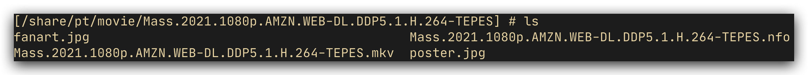

# qb下载后自动硬链接到媒体库

## 问题现状

之前，我使用qb下载会开启`创建子文件夹`的模式，这样在下载种子中即便只有单个文件，也会创建一个同种子名的文件夹，方便对其进行搜刮。

如图，仅仅只有mkv文件是种子中的文件，其余全是搜刮后的新文件

但是，为了更方便的在qbittorrent和transmission中转移种子，不得已改回了默认的**origin**模式，即单个文件的种子会直接下载到目标文件夹中

这样带来的问题就是，在这样的基础上搜刮后会导致文件结构杂乱，搜刮文件冲突、不好管理等问题，所以还是需要为单个文件创建文件夹

## 解决方案

想过几种通用的方案，都有或多或少有缺陷，无法使用。

最后，想到了一种`约定`优先的方案，即下载文件夹仍然保持`origin`的模式便于qb和tr互相转种，原先我是直接将下载文件夹作为emby的媒体库来使用的，现在则需要创建一个单独的文件夹,可以理解为下载文件夹的影子(shadow)文件夹作为媒体库，这样pt可以保证种子文件的位置，而媒体库的文件夹则可以任意创建子文件夹来管理单个种子文件

## 示例

### 单文件种子

假设一个单文件种子`快乐星球.torrent`，里面只有一个文件`快乐星球.mp4`，下载到/download/movie，那么下载后会有`/download/movie/快乐星球.mp4`  

下载完成后，脚本首先会在下载文件夹的同级目录创建一个影子文件夹`/download/movie-shadow`，会在影子文件夹中创建一个和种子名相同的文件夹`/download/movie-shadow/快乐星球`，并把实际文件软链接到该文件夹中`/download/movie-shadow/快乐星球/快乐星球.mp4@`  

这个软链接的地址是一个**相对路径**，指向`../../movie/快乐星球.mp4`

### 多文件种子

这个只需要将文件夹软链接到影子文件夹即可，不赘述

## 使用说明

将`auto_link.sh`映射到qb容器中，例如`/tmp/auto_link.sh`

在qb的完成后执行脚本配置中配置`/tmp/auto_symbollink.sh "%N" "%F" "%D" "%R"`

如果并非所有下载文件夹你都希望映射，那么你可以在环境变量中配置`INCLUDE_LINK_PATH=movie,series`，仅下载文件路径(不含种子名称)中包括这些关键字的文件才会被映射

也可以设置`SHADOW_SUFFIX=media`来改变影子文件夹的后缀，默认是`shadow`